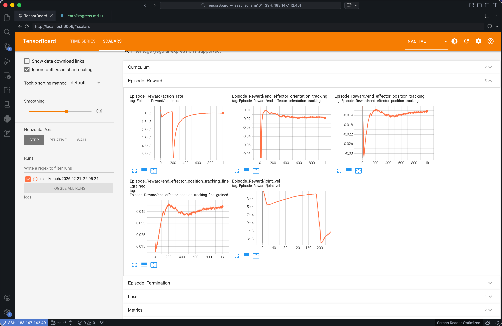
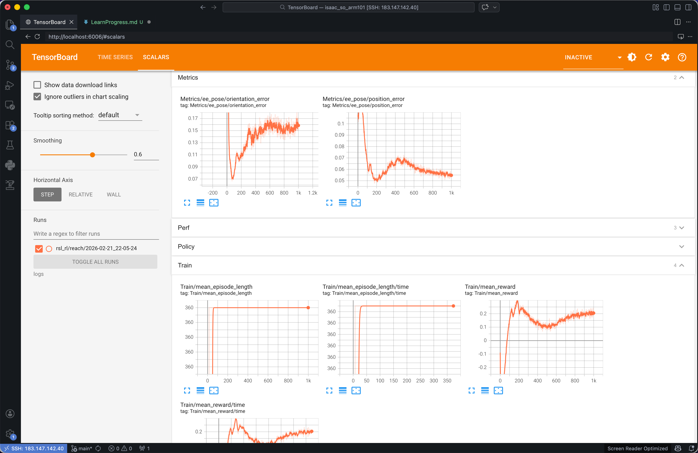
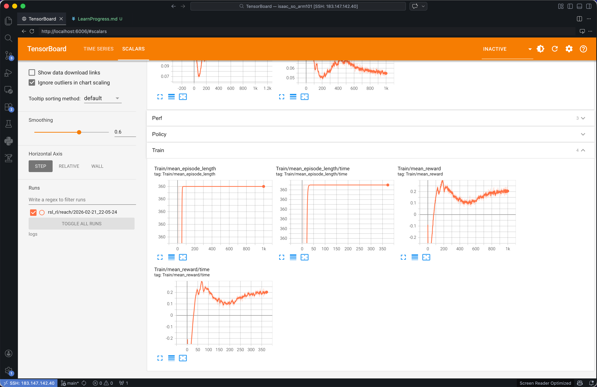

# 一、Isaac Lab 与强化学习基础

## 学习内容

- **Isaac Lab 框架结构**：理解 envs、assets、actuators 模块，学习配置文件系统
- **Isaac Sim 环境部署**：安装配置，熟悉 USD 场景和基本 Python API
- **PPO 强化学习算法**：掌握 Actor-Critic 架构、PPO 原理、训练流程

## 实践任务

- [ ] 运行 Reach 等预置任务
- [ ] 修改配置文件观察训练效果变化


1. 运行随机动作看看环境长什么样 —— random_agent（随机乱抖）

观察点：熟悉 Isaac Sim 的界面、播放/暂停按钮、场景树（Stage）以及物理引擎的运作。
```bash
uv run random_agent --task Isaac-SO-ARM100-Reach-Play-v0
```

2. 开始训练 —— train（PPO训练）
```bash
uv run train --task Isaac-SO-ARM100-Reach-v0 --headless
```

3. 查看模型训练结果 —— TensorBoard
```bash
tensorboard --logdir logs
```
强化学习里，我们不看准确率，我们看“它赚了多少分（Reward）”以及“它的物理误差有多小（Metrics）”。
2. 解读你截图里的这 5 张图（拆解的奖励项）
你现在展开的是 Episode_Reward 栏目，这里面把机器人的“总分”拆成了好几个“单项得分”。我们一个个看：
📈 左下角 ..._position_tracking_fine_grained（精细位置追踪奖励）
怎么看：注意看左边的 Y 轴，数字是正数（从 0.015 涨到了 0.045左右）。
啥意思：这是机械臂最核心的得分项！只要末端越靠近目标，它拿的分就越高。这条曲线在稳步爬坡，说明机械臂正在快速学会把手伸向目标！
📉 左上角 action_rate (动作变化惩罚) & 右下角 joint_vel (关节速度惩罚)
怎么看：注意 Y 轴，数字全是负数（比如 -5e-4），并且呈现一个巨大的“深V”字型。
啥意思：这是老师代码里写的**“扣分项”！在刚开始训练时（0~200步），机械臂像无头苍蝇一样疯狂乱甩（就是你之前看到的帕金森状态），导致动作巨大，被系统疯狂扣分**（曲线暴跌）。
为什么后来又涨回去了？ 因为神经网络被扣分扣怕了！它学乖了，发现“只要我动作平滑一点，少出点力，就不会被扣分”。所以 200 步之后，曲线重新涨回了 0 附近。这就是机械臂运动变得“平滑”的根本原因！
📉 右上角的两个 ..._tracking (基础位置/姿态追踪)
这也是负数，通常是直接计算距离的负值（距离越远，扣分越多）。你能看到它也是先掉下去，然后慢慢爬升回 -0.015 左右，说明误差在缩小。



Metrics/ee_pose/position_error（末端位置误差） ⭐️⭐️⭐️
这是最直观的物理指标！单位通常是米（m）。如果这个曲线最终收敛（下降）到 0.02 甚至 0.01 以下，说明你的机械臂能精准指到目标点 1~2 厘米的范围内。这就是你判断精度的绝对标准！



Train/Episode Reward（单局总得分）
这是把上面所有的加分和扣分加起来的总和。这条线必须是稳步上升，最后平稳（Plateau）。

Train/Episode Length（单局步数/耗时）
系统设定达到目标就会结束当前回合（Episode）。如果机械臂变聪明了，它抓到目标的速度就会越来越快。所以这条曲线应该是稳步下降的，说明它越来越干脆利落。




4. 运行模型 —— play（平滑验证）
在代码的设定中，系统每隔几秒钟（或者当机械臂到达目标后），就会在它周围半空中的有效工作空间内，随机生成一个隐形的 3D 坐标点 (X,Y,Z)机械臂的“大脑”（你刚训练好的神经网络）在不断计算：“我该怎么转动这 6 个电机的角度，才能让我的机械爪尖端最快、最稳地碰过去？” 碰到了，就算成功一次，然后系统立刻刷出下一个目标点让它继续够。
```bash
uv run play --task Isaac-SO-ARM100-Reach-Play-v0
```

指定模型运行
```bash
uv run play --task Isaac-SO-ARM100-Reach-Play-v0 --checkpoint logs/rsl_rl/reach/2026-02-22_10-12-13/model_440.pt
```


## 二、RM_ECO65 机器人建模

### 学习内容

- **URDF 转 USD**：使用 Isaac Sim 的 URDF Importer 工具转换模型
- **机器人关节与惯量建模**：配置 ArticulationCfg，设置关节参数和惯性
- **驱动器参数配置**：配置 ImplicitActuator，设置力矩限制、速度限制、PD 参数

### 实践任务

- [x] 将 RM_ECO65 的 URDF 转换为 USD
- [ ] 创建 ArticulationCfg 配置机器人

------


## 三、末端强化学习控制

### 学习内容

- **Task 编写**：创建RM_ECO65 RL环境，实现场景重置和终止条件
- **Observation 构造**：设计状态空间，使用 ObservationManager
- **Reward 设计**：构建密集奖励函数，平衡多个奖励项
- **PPO 超参数调优**：调整学习率、batch size、clip range 等参数

### 实践任务：构建末端 Reach 任务

**Observation (16维)**

- 关节角
- 关节速度
- 末端到目标向量
- 目标位置

**Action (6维)**

- 关节增量控制

**Reward**

- 距离奖励
- 动作惩罚
- 关节速度惩罚
- 成功奖励
- ...

**预期效果**

- 能在nvidia仿真软件内控制RM_ECO65机械臂到点

### 训练目标

- 成功率 > 90%
- 平均到达时间 < 2秒
- 泛化到不同目标位置

```bash
  uv run play --task Isaac-SO-ARM100-Reach-Play-v0 \
    --checkpoint logs/rsl_rl/reach/2026-02-22_19-45-45/model_510.pt \
    --stochastic_std 0.05
```

------


## 学习资源

- Isaac Lab 官方文档与示例代码
- https://github.com/MuammerBay/isaac_so_arm101/tree/main 